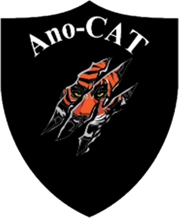

# Ano-CAT

# ReadME

본 Repo는 부산대학교 해커톤 참여를 목적으로 만들었습니다.

사용된 오픈 소스 라이브러리 및 소스는 아래와 같습니다.

## 사용 Source (WEB)

- [Business Frontpage - Bootstrap 5 Business Home Page Template - Start Bootstrap](https://startbootstrap.com/template/business-frontpage)
- [Freelancer - One Page Theme - Start Bootstrap](https://startbootstrap.com/theme/freelancer)
- [SB Admin 2 - Free Bootstrap Admin Theme - Start Bootstrap](https://startbootstrap.com/theme/sb-admin-2)

## 사용 Source (Experiment)

- [CNC Mill Tool Wear | Kaggle](https://www.kaggle.com/shasun/tool-wear-detection-in-cnc-mill) / CNC MILLING DATASET - UNIVERSITY OF MICHIGAN SMART LAB

## 사용 Package

- [SKTIME](https://sktime.org/)
- [Anaconda | Individual Edition](https://www.anaconda.com/products/individual)
- [scikit-learn: machine learning in Python — scikit-learn 0.16.1 documentation](https://scikit-learn.org/)
- [Using Voilà — voila 0.2.12 documentation](https://voila.readthedocs.io/en/stable/using.html)
- [Bokeh documentation — Bokeh 2.4.0 Documentation](http://docs.bokeh.org/en/latest/)
